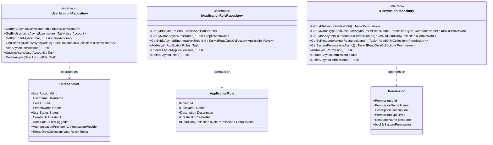

# Domain Model Diagrams

This document provides visual representations of the domain model to help understand the structure and relationships between entities, value objects, and aggregates.

## Class Diagram: Core Domain Model

The following diagram shows the core entities and their relationships in the domain model:

## Class Diagram: Value Objects

The following diagram shows the value objects used in the domain model:

## Aggregate Boundaries

The following diagram shows the aggregate boundaries in the domain model:

## Domain Events Flow

The following diagram shows the flow of domain events in the system:

## Authentication Flow

The following diagram shows the authentication flow for both providers:

## Authorization Flow

The following diagram shows the authorization flow:

## Factory Pattern for Authentication Providers

The following diagram shows the factory pattern used for authentication providers:

## Domain Services Interaction

The following diagram shows how domain services interact with each other and with repositories:

## Entity-Repository Relationship

The following diagram shows the relationship between entities and repositories:

## Domain Events Hierarchy

The following diagram shows the hierarchy of domain events:

## Database Schema

The following diagram shows the database schema for the domain model:

These diagrams provide a comprehensive visual representation of the domain model, helping to understand the structure, relationships, and behavior of the system.
